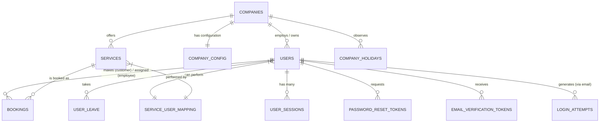
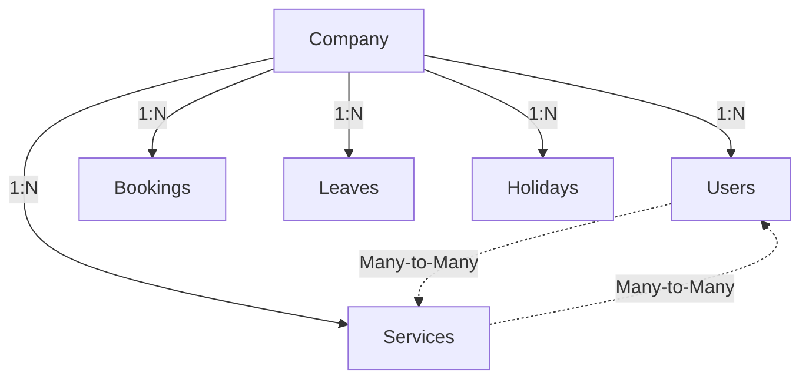
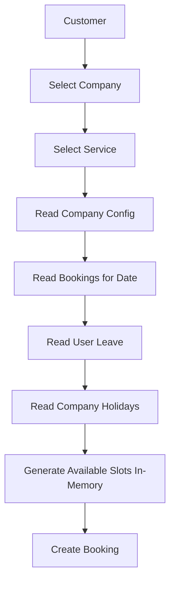

# Database Design

## Architectural Foundation

For BookSlot, we have chosen **PostgreSQL** as the primary relational database and **Prisma ORM** for database interaction and schema management. PostgreSQL provides robust support for concurrent transactions, advanced indexing, and JSONB types (essential for flexible configuration storage). Prisma ensures type safety, predictable query performance, and maintainable schema migrations.

---

## Database Tables

### 1. `users`
This table serves as the central identity repository for all system actors.

| Field | Type | Description |
|-------|------|-------------|
| `id` | UUID | Primary Key |
| `company_id` | UUID (Nullable) | Foreign key to `companies` (Null for customers and super admins) |
| `first_name` | String | User's first name |
| `last_name` | String | User's last name |
| `email` | String | Unique email address |
| `phone` | String | Contact number |
| `password_hash` | String | Argon2/bcrypt hashed password |
| `role` | Enum | `APP_SUPER_ADMIN`, `OWNER`, `EMPLOYEE`, `CUSTOMER` |
| `status` | Enum | `ACTIVE`, `INACTIVE`, `SUSPENDED` |
| `email_verified_at` | DateTime (Nullable) | Timestamp of email verification |
| `last_login_at` | DateTime (Nullable) | Timestamp of last login |
| `created_at` | DateTime | Timestamp of creation |
| `updated_at` | DateTime | Timestamp of last update |
| `deleted_at` | DateTime (Nullable) | Soft delete timestamp |

**Design Decision:** We chose a **Single Table Inheritance (STI)** approach for users rather than separate `customers`, `owners`, and `employees` tables. 
- **Why?** It simplifies authentication, authorization, and session management. A user could potentially be an owner of one business and a customer at another. Consolidating identities reduces data duplication, simplifies the auth middleware, and makes cross-role queries much more efficient.

### 2. `companies`
Represents the business entities offering services.

| Field | Type | Description |
|-------|------|-------------|
| `id` | UUID | Primary Key |
| `owner_user_id` | UUID | Foreign key to `users` (Owner) |
| `name` | String | Business name |
| `email` | String | Business contact email |
| `phone` | String | Business contact phone |
| `address` | String | Physical location |
| `timezone` | String | IANA timezone (e.g., `America/New_York`) |
| `status` | Enum | `ACTIVE`, `INACTIVE` |
| `created_at` | DateTime | Timestamp of creation |
| `updated_at` | DateTime | Timestamp of last update |
| `deleted_at` | DateTime (Nullable) | Soft delete timestamp |

### 3. `company_config`
Stores the operational rules and scheduling boundaries for a company.

| Field | Type | Description |
|-------|------|-------------|
| `company_id` | UUID | Primary / Foreign Key |
| `opening_time` | Time | Daily opening time |
| `closing_time` | Time | Daily closing time |
| `working_days` | JSONB | e.g., `["MONDAY", "TUESDAY", "WEDNESDAY"]` |
| `slot_duration` | Int | Base duration of a slot in minutes (e.g., 15, 30) |
| `booking_window_days`| Int | How far in advance bookings can be made |
| `allow_same_day_booking`| Boolean | Can customers book for today? |
| `cancellation_hours` | Int | Hours required for penalty-free cancellation |
| `timezone` | String | Config-specific timezone fallback |
| `updated_at` | DateTime | Timestamp of last update |

**Design Decision:** We separated configuration from the `companies` table.
- **Why?** Separation of concerns. The `companies` table handles core identity and billing-related metadata, while `company_config` is strictly for operational logic. This allows us to load core company data quickly without pulling in heavy JSONB config fields unless we are actively rendering booking flows. It also paves the way for versioning configurations in the future.

### 4. `services`
Defines the offerings provided by a company.

| Field | Type | Description |
|-------|------|-------------|
| `id` | UUID | Primary Key |
| `company_id` | UUID | Foreign key to `companies` |
| `name` | String | Service name (e.g., "Men's Haircut") |
| `description` | Text | Details about the service |
| `duration_minutes` | Int | How long the service takes |
| `price` | Decimal | Cost of the service |
| `status` | Enum | `ACTIVE`, `INACTIVE` |
| `created_at` | DateTime | Timestamp of creation |
| `updated_at` | DateTime | Timestamp of last update |
| `deleted_at` | DateTime (Nullable) | Soft delete timestamp |

### 5. `service_user_mapping`
Resolves which employees can perform which services.

| Field | Type | Description |
|-------|------|-------------|
| `id` | UUID | Primary Key |
| `company_id` | UUID | Foreign key to `companies` |
| `service_id` | UUID | Foreign key to `services` |
| `user_id` | UUID | Foreign key to `users` (Employee) |

**Design Decision:** This is a **Many-to-Many mapping table**.
- **Why?** Not all employees are qualified to perform all services. A junior stylist cannot offer complex coloring services. This mapping is strictly required to filter which staff members are available when a customer selects a specific service. It forms the basis of the availability algorithm.

### 6. `bookings`
The central transactional entity.

| Field | Type | Description |
|-------|------|-------------|
| `id` | UUID | Primary Key |
| `booking_number` | String | Unique human-readable reference |
| `company_id` | UUID | Foreign key to `companies` |
| `customer_id` | UUID | Foreign key to `users` |
| `service_id` | UUID | Foreign key to `services` |
| `assigned_user_id` | UUID | Foreign key to `users` (Employee) |
| `appointment_date` | Date | The date of the booking |
| `start_time` | Time | When the service begins |
| `end_time` | Time | When the service ends |
| `status` | Enum | `PENDING`, `CONFIRMED`, `COMPLETED`, `CANCELLED`, `NO_SHOW` |
| `notes` | Text | Customer or staff notes |
| `created_at` | DateTime | Timestamp of creation |
| `updated_at` | DateTime | Timestamp of last update |

**Design Decision:** Bookings act as the **absolute source of truth** for time block allocation.
- **Why?** Instead of tracking "empty slots," we track "occupied time blocks." If a time block falls within the company's working hours, isn't blocked by holidays/leave, and has no overlapping `CONFIRMED` or `COMPLETED` booking in this table, it is intrinsically available. This prevents synchronization issues.

### 7. `user_leave`
Tracks ad-hoc unavailability for specific staff members (sick days, vacations).

| Field | Type | Description |
|-------|------|-------------|
| `id` | UUID | Primary Key |
| `company_id` | UUID | Foreign key to `companies` |
| `user_id` | UUID | Foreign key to `users` (Employee) |
| `start_datetime` | DateTime | Start of leave |
| `end_datetime` | DateTime | End of leave |
| `reason` | String | e.g., "Sick leave", "Vacation" |
| `status` | Enum | `APPROVED`, `PENDING`, `REJECTED` |

### 8. `company_holidays`
Tracks global company-wide closures.

| Field | Type | Description |
|-------|------|-------------|
| `id` | UUID | Primary Key |
| `company_id` | UUID | Foreign key to `companies` |
| `holiday_date` | Date | Date the company is closed |
| `reason` | String | e.g., "Christmas", "National Holiday" |

### 9. `user_sessions`
Explicitly tracks sessions to enable Multiple Device Login, Session Tracking, and secure Refresh Token Rotation.

| Field | Type | Description |
|-------|------|-------------|
| `id` | UUID | Primary Key |
| `user_id` | UUID | Foreign key to `users` |
| `refresh_token_hash`| String | SHA256 hash of the issued refresh token |
| `device_name` | String | Extracted device name |
| `device_type` | String | Mobile, Desktop, Tablet |
| `browser` | String | Extracted browser info |
| `operating_system` | String | Extracted OS info |
| `ip_address` | String | IP at the time of login |
| `user_agent` | String | Raw User-Agent string |
| `expires_at` | DateTime | Expiration of the refresh token |
| `last_used_at` | DateTime | Last time the session was active |
| `revoked_at` | DateTime (Nullable)| Revocation timestamp |
| `created_at` | DateTime | Session creation time |
| `updated_at` | DateTime | Last update time |

### 10. `password_reset_tokens`
Stores hashed reset tokens to secure the forgot-password flow.

| Field | Type | Description |
|-------|------|-------------|
| `id` | UUID | Primary Key |
| `user_id` | UUID | Foreign key to `users` |
| `token_hash` | String | Hashed reset token |
| `expires_at` | DateTime | Expiration time (e.g., 1 hour) |
| `used_at` | DateTime (Nullable)| When the token was consumed |
| `created_at` | DateTime | Creation timestamp |

### 11. `email_verification_tokens`
Stores hashed verification tokens for new user registration.

| Field | Type | Description |
|-------|------|-------------|
| `id` | UUID | Primary Key |
| `user_id` | UUID | Foreign key to `users` |
| `token_hash` | String | Hashed verification token |
| `expires_at` | DateTime | Expiration time |
| `used_at` | DateTime (Nullable)| When the token was consumed |
| `created_at` | DateTime | Creation timestamp |

### 12. `login_attempts`
Tracks login requests to provide brute-force protection and rate limiting.

| Field | Type | Description |
|-------|------|-------------|
| `id` | UUID | Primary Key |
| `email` | String | Attempted email |
| `ip_address` | String | Originating IP |
| `success` | Boolean | Boolean indicating outcome |
| `created_at` | DateTime | Timestamp of attempt |

---

## ER Relationships

### Entity-Relationship Diagram

### Relationship Flow Diagram

### Explanation of Relationships

- **Company ↓ Users:** A company has many users (employees). A user belongs to a company via `company_id`. Customers and Super Admins have a null `company_id`.
- **Company ↓ Services:** A company defines a catalog of multiple services.
- **Company ↓ Bookings:** All bookings belong to a company for tenancy scoping and analytics.
- **Company ↓ Leaves / Holidays:** Time-off logic is scoped per company.
- **Service ↔ Users:** This is a crucial Many-to-Many relationship implemented via `service_user_mapping`. It connects employees to the specific services they are authorized to perform. 
- **Users ↓ Auth Tables:** A user can have multiple sessions, reset tokens, verification tokens, and login attempts directly tied to their identity.

---

## Constraints

To guarantee data integrity, the following constraints are enforced at the database level:

1. **Unique Email:** `users.email` is strictly unique across the system to enforce single-identity login.
2. **Unique Booking Number:** `bookings.booking_number` is a unique index for customer support reference.
3. **Foreign Keys:** Enforced on all relational ID columns (`company_id`, `user_id`, `service_id`) to prevent orphaned records.
4. **Cascade Rules:** 
   - `ON DELETE CASCADE` for configuration, holidays, and `service_user_mapping` when a company or service is deleted.
   - `ON DELETE RESTRICT` for `bookings` when a user or service is deleted (we must retain financial/booking history).
5. **Soft Delete Strategy:** Core entities (`users`, `companies`, `services`) use a `deleted_at` timestamp. Queries are scoped with `WHERE deleted_at IS NULL`.
6. **Indexes:** 
   - BTREE indexes on foreign keys (`company_id`, `customer_id`, `assigned_user_id`).
   - Index on `bookings.appointment_date` for fast availability lookups.

### The Double-Booking Prevention Constraint

**Composite Unique Constraint:** `(assigned_user_id, appointment_date, start_time)` on the `bookings` table.

**Why this prevents concurrent booking:** Even if two customers try to book the exact same slot at the exact same millisecond, the database engine enforces this constraint synchronously. The first transaction commits, and the second transaction fails at the database level with a unique constraint violation. This guarantees that an employee can never be double-booked for the same start time on the same day, completely removing race conditions from the application layer.

---

## Design Decisions

### Why No Availability Table?

One of the most critical architectural decisions is **not** storing pre-calculated availability slots in the database. 

**The Naive Approach:** Storing a record for every possible slot (Company × Users × Slots × Days). If a company has 10 employees, open 8 hours a day, with 15-minute slots, that's `10 * 32 = 320` records *per day*. For a 90-day booking window, that's `28,800` rows per company. For 1,000 companies, you're storing **~28 million rows of mostly empty slots**.

**Our Approach:** Generate slots dynamically. We store only constraints (`company_config`, `company_holidays`, `user_leave`) and state (`bookings`).

**Comparison:**
- **Storage:** Dynamic generation uses near-zero storage for availability. The naive approach causes massive database bloat.
- **Maintenance:** If an owner changes opening hours from 9 AM to 10 AM, the naive approach requires a massive batch job to delete/update thousands of future slot rows. In our dynamic approach, the configuration change is instant and zero-cost; the next availability query simply generates slots starting at 10 AM.
- **Scalability:** Querying existing bookings for a specific date and projecting them over a time matrix in-memory (Node.js) is vastly faster than querying massive tables of boolean slots.
- **Simplicity:** The dynamic approach ensures the `bookings` table is the single source of truth, eliminating the risk of a "slot" being marked `available=true` while a booking exists due to a failed transaction.

#### Slot Generation Flow

---

## Performance Considerations

- **Indexes:** Aggressive indexing on `appointment_date`, `status`, and `company_id` allows the availability generation query to execute in single-digit milliseconds. Additional indexes on auth tables (`user_sessions.refresh_token_hash`, `login_attempts.email`) ensure rapid authentication flows.
- **Transactions:** Booking creation is wrapped in a Prisma `SERIALIZABLE` transaction to read limits and write the booking safely, leaning on the unique constraint for fallback.
- **Future Redis Caching:** If read traffic spikes, availability for a specific `(company_id, date)` can be cached in Redis with a TTL, and invalidated via a webhook or event emitter whenever a booking, leave, or config is updated.
- **Timezone Support:** All datetimes are stored in UTC. Local boundaries (like opening hours) are stored as strings (`"09:00"`) and calculated relative to the `company_config.timezone` dynamically at runtime, immune to Daylight Saving Time edge cases.

---

## Future Scalability

While the current schema is intentionally minimal to satisfy the core booking flow assignment, it is designed to be easily extensible. 

Future scalable tables (not designed here) would hook into this foundation:
- `payments` (linked to `bookings.id`)
- `subscriptions` (linked to `companies.id` for SaaS billing)
- `notifications` (linked to `users.id`)
- `reviews` (linked to `bookings.id` and `services.id`)
- `audit_logs` (for tracking changes to `company_config` and auth events)
- `branches` (adding a branch layer between companies and users for multi-location)
- `calendar_integrations` (storing OAuth tokens for Google/Outlook sync)
